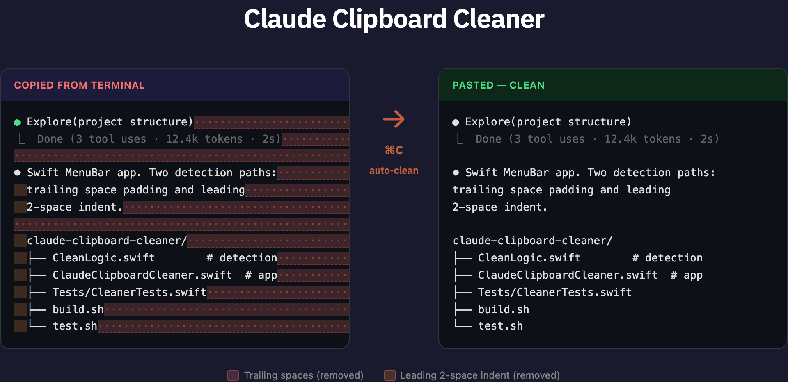

# Claude Clipboard Cleaner

macOS MenuBar app that automatically cleans Claude Code terminal output when you copy it.



When you copy text from Claude Code's terminal, it comes with trailing space padding and leading 2-space indentation. This app detects that pattern and strips it automatically — so your paste is always clean.

## Install

```bash
brew install --cask esc5221/tap/claude-clipboard-cleaner
```

Or download the DMG from [Releases](https://github.com/esc5221/claude-clipboard-cleaner/releases).

## Usage

Launch the app — it sits in your menu bar as **⌘C**. That's it.

- Clipboard is monitored automatically (0.3s polling)
- Icon flashes **✓** when a clean happens
- Click the menu bar icon for Enable/Disable, Launch at Login, and clean count

## How it works

**Two independent detection paths:**
- **Trailing space padding** — terminal copy pads lines to fixed width with spaces. If 50%+ of lines have ≥3 trailing spaces, it strips them.
- **Leading 2-space pattern** — Claude response text uses consistent 2-space indent. If 60%+ of lines match, it strips the indent.

## Build from source

```bash
git clone https://github.com/esc5221/claude-clipboard-cleaner.git
cd claude-clipboard-cleaner
./build.sh
open "build/Claude Clipboard Cleaner.app"
```

## Test

```bash
./test.sh
```

## Requirements

- macOS 13.0+ (Ventura)
- Apple Silicon (arm64)

## License

MIT
